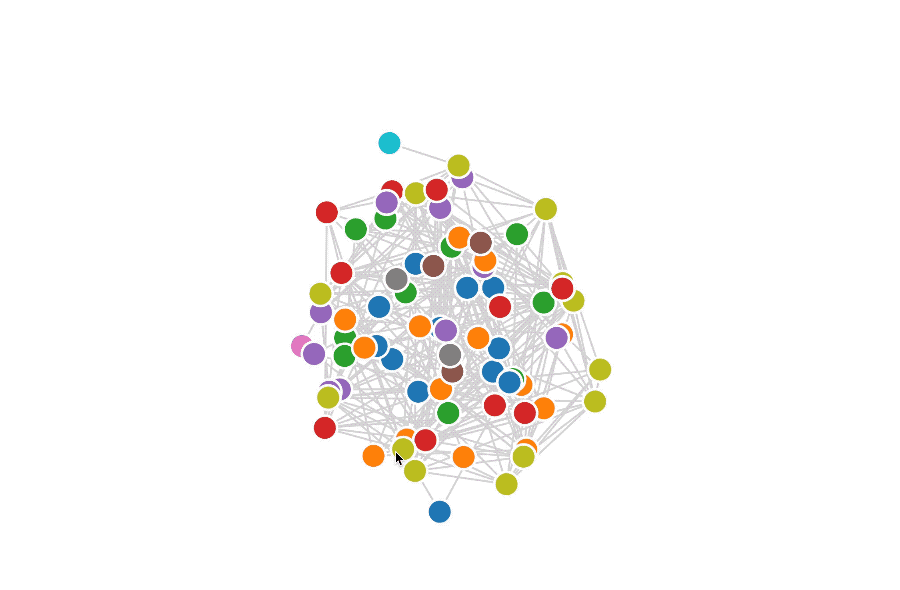

# vue-network-d3

> D3 Force-Directed Graph as Vue Component.

## Demo

- [Simple Demo]()

  

- [Film Knowledge Graph]()

  

## Install

```
npm install vue-network-d3 --save
```

## Quick Start

```vue
<template>
  <div id="app">
    <network :nodeList="nodes" :linkList="links"></network>
  </div>
</template>

<script>
import Network from "vue-network-d3";

export default {
  name: "app",
  components: {
    Network
  },
  data() {
    return {
      nodes: [
      	{"id": "Myriel", "group": 1},
      	{"id": "Napoleon", "group": 1},
        {"id": "Labarre", "group": 2},
        {"id": "Valjean", "group": 2}
      ],
      links: [
        {"source": "Napoleon", "target": "Myriel", "value": 1},
        {"source": "Valjean", "target": "Labarre", "value": 1},
        {"source": "Napoleon", "target": "Valjean", "value": 2},
      ]
    };
  },
};
</script>

<style>
body {
  margin: 0;
}
</style>

```

## Props

### Overview

```js
props: {
		nodeList: Array,
    linkList: Array,
    // node related:
    nodeSize: {
      type: Number,
      default: 14
    },
    nodeTextKey: {
      type: String,
      default: "id"
    },
    nodeTypeKey: {
      type: String,
      default: "group"
    },
    nodeTextFontSize: {
      type: Number,
      default: 14
    },
    bodyStrength: {
      type: Number,
      default: -150
    },
    // link related:
    linkWidth: {
      type: Number,
      default: 2
    },
    showLinkText: {
      type: Boolean,
      default: false
    },
    linkTextKey: {
      type: String,
      default: "value"
    },
    linkTypeKey: {
      type: String,
      default: "type"
    },
    linkTextFrontSize: {
      type: Number,
      default: 10
    },
    linkDistance: {
      type: Number,
      default: 50
    },
    // svg raleted:
    svgSize: {
      type: Object,
      default: () => {
        return {
          width: window.innerWidth,
          height: window.innerHeight
        };
      }
    },
    svgTheme: {
      type: String,
      default: "light" // dark or light
    },
    // others:
    highlightNodes: {
      type: Array,
      default: () => {
        return [];
      }
    }
}

```

### Detailed Design

> 「:star:」​ means necessary

- :star: ​**nodeList**: Array of **Node Object** which has

  - :star: **id**: Number or String. Node id and also node name (can be changed by **nodeTextKey**)
  - **group**: Number or String. like node type (can be changed by **nodeTypeKey**)

- :star: **linkList**: Array of **Link Object** which has

  - :star: **source**: Number or String. Id of source node.
	- :star: **target**: Number or String. Id of target node.
  - **value**: Number or String. Link name (can be changed by **linkTextKey**)

- **nodeSize**: Number.

- **nodeTextKey**: String. Key of node text/name. The default value is 'id',  you need to set it to 'name' if your node object is like:

  ```json
  {
  	id: 1010,
    name: 'Myriel'
  }
  ```

- **nodeTypeKey**: String. Key of node type. The default value is 'group', you need to set it to 'type' if your node object is like: 

  ```js
  {
    id: 'Myriel',
    type: 1
  }
  ```

- **nodeTextFontSize**: Number.

- **linkWidth**: Number.

- **showLinkText**: Boolean. Show link text or not. Suggest keeping it **false**, link text will show when you hover on the link.

- **linkTextKey**: String. Key of link text/name. The default value is 'value', you need to set it to 'name' If your link object is like: 

  ```js
  {
  	source: 'Napoleon',
    target: "Myriel", 
    name: 'friend'
  }
  ```

- **linkTypeKey**: String. Key of link type. The default value is 'type'.

- **linkTextFrontSize**: Number.

- **linkDistance**: Number.

- **svgSize**: **Object** which has

  - **width**: Number.
  - **height**: Number

- **svgTheme**: String. 'light' or 'dark', 'light' is default.

- **bodyStrength**: Number. *A positive value causes nodes to attract each other, similar to gravity, while a negative value causes nodes to repel each other, similar to electrostatic charge*.

- **highlightNodes**: Array of node id. Stroke of nodes turn yellow.

  

## Events

- **clickNode**: emits **(event, node-object)**
- **clickLink**: emits **(event, link-object)**
- **hoverNode**: emits **(event, node-object)**
- **hoverLink**: emits **(event, link-object)**


## Classes

- **.element**: all nodes and links
- **.node**: all nodes
- **.link**: all links
- **.[type]**: nodes where node[nodeTypeKey] == type, links where link[linkTypeKey] == type
- **.selected**: selected nodes (clicked node with its first layer nodes)


## Reference

Repo: [vue-d3-network](https://github.com/emiliorizzo/vue-d3-network),  Vue component to graph networks using d3-force.


## TODO

- [ ] Docs: props and events
- [ ] Learn [Vue-CLI](https://cli.vuejs.org/zh/) more
- [ ] Fix: node's style when hover
- [ ] Travis CI


